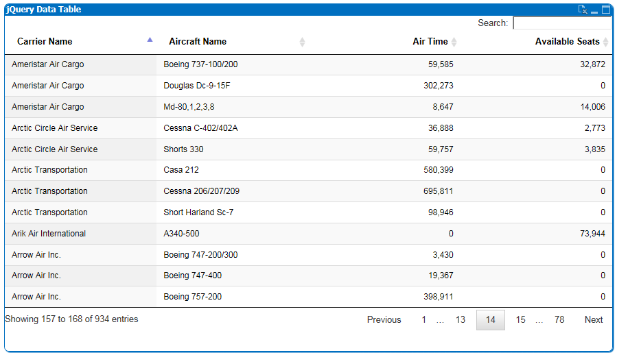
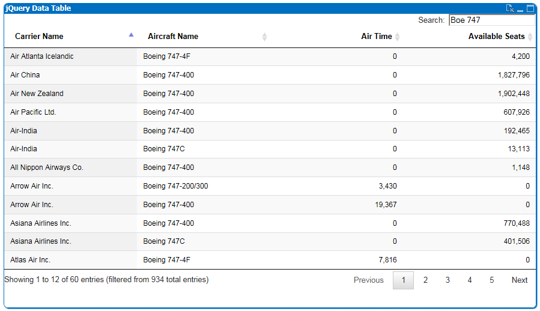
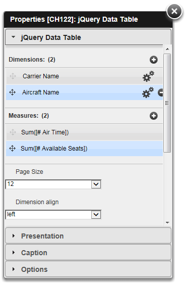
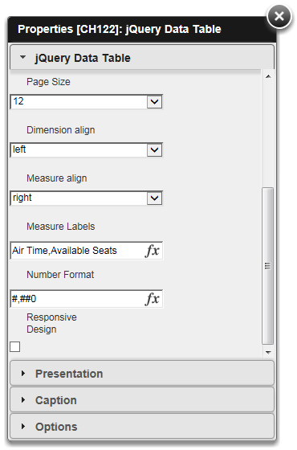

QlikView Extension jQueryDatatable
==================================

This extension implements DataTable Plugin for jQuery: http://www.datatables.net/

Properties:
-----------

1. Dimensions       : multiple Dimensions fr underlying straight table
2. Measures         : multiple Measures fr underlying straight table
3. Dimension align  : Dimension cell alignment (left,center,right)
4. Measure align    : Measure cell alignment (left,center,right)
5. Number Format    : Number Format for Measures (defaul #,##0.00)
6. Responsive Design: Use Responsive Design, most suitable for mobile clients